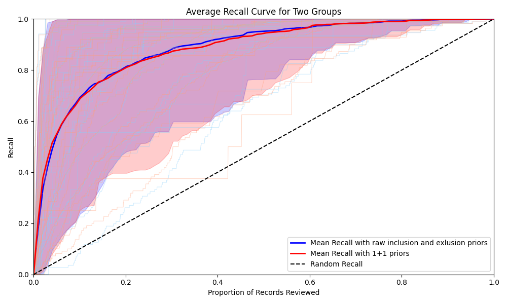
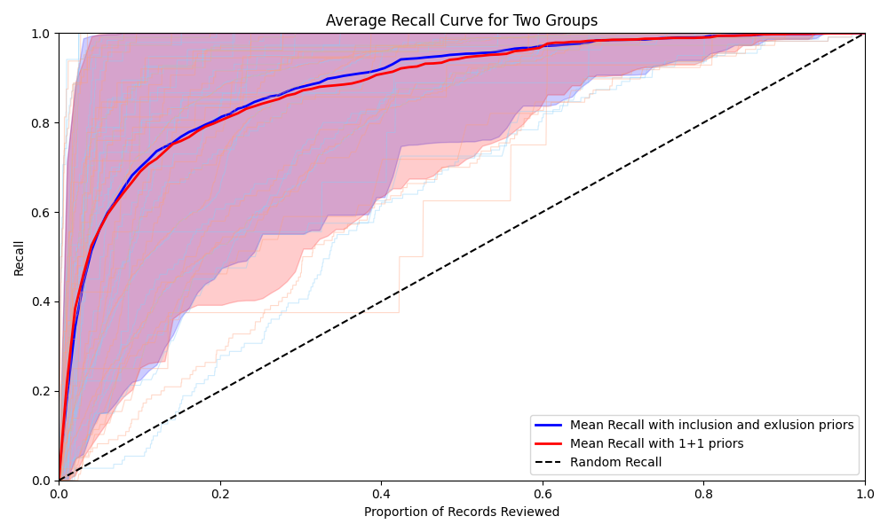

# Using Inclusion and Exclusion Criteria as Priors

Testing how well it works to use inclusion and exclusion criteria as priors for ASReview. Simulations will be run using Makita. Initially simulations will be done on the synergy datasets. 

## Data 

The data for the inclusion and exclusion criteria are based upon [PR #115 in synergy-dataset](https://github.com/asreview/synergy-dataset/pull/115). Two versions are used, a raw and a cleaned version.

For the raw inclusion/exclusion data the starting point were the eligibility criteria from the [Synergy repository](https://github.com/asreview/synergy-dataset). These were then manually split into an inclusion and exclusion statement, without altering the text.

The cleaned up data was created in the following way:

The starting point were the eligibility criteria that can be found in the Synergy repository.
Then, the following steps were done manually:
- Distribute criteria over multiple lines (1 per (set) of criteria)
- Strip all parts that mean include/exclude (this usually includes the word "not")
- Strip all parts that explain why something was included/excluded
- And/Or: And is usually distributed over multiple lines, or is kept in the same line.
- Some papers have duplicate inverted criteria (the exclusion contains a negative), in those cases I removed the negative criteria (as they were already in the other list)
- Criteria for the search were not included in the list
- The text was kept the same as much as possible.

## Preliminary Results

**Comparing raw criteria with a standard 1+1 prior starting point.**

Comparing the two visually. The plot below shows the recall for each synergy dataset and their average recall for both the raw criteria and the 1+1 prior starting point.

We can also numerically express this by looking at the loss for each simulation here: [View Loss Raw Table](output/Loss_raw.csv)

**Comparing cleaned criteria with a standard 1+1 prior starting point.**

Comparing the two visually. The plot below shows the recall for each synergy dataset and their average recall for both the cleaned criteria and the 1+1 prior starting point.

We can also numerically express this by looking at the loss for each simulation here: [View Loss Raw Table](output/Loss_cleaned.csv)
